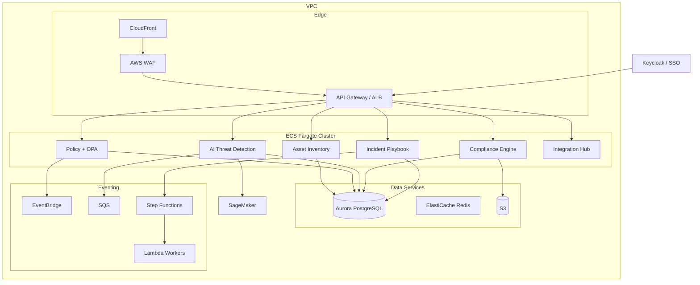

# SME AI Security Platform – Design & Architecture Synthesis

**Date:** 2026-05-26 | **Scope:** SMEs with 10–500 employees | **Model:** Hybrid (Build + Buy)

---

## Table of Contents

1. [Context & Problem Statement](#1-context--problem-statement)
2. [North Star Metric](#2-north-star-metric)
3. [Real-World User Experience](#3-real-world-user-experience)
4. [Build vs Buy Strategy](#4-build-vs-buy-strategy)
5. [System Architecture](#5-system-architecture)
6. [6 Core Architectural Approaches](#6-6-core-architectural-approaches)
   - 6.1 [AI Governance & Threat Detection](#61-ai-governance--threat-detection)
   - 6.2 [Automated Incident Playbooks](#62-automated-incident-playbooks)
   - 6.3 [API-First Integration](#63-api-first-integration)
   - 6.4 [Lightweight Endpoint Agent & Browser Extension](#64-lightweight-endpoint-agent--browser-extension)
   - 6.5 [Multi-Tenancy & Data Privacy](#65-multi-tenancy--data-privacy)
   - 6.6 [Event-Driven Architecture & Resilience](#66-event-driven-architecture--resilience)
7. [Team & 6-Month Delivery Plan](#7-team--6-month-delivery-plan)
8. [Next Version Roadmap](#8-next-version-roadmap)

---

## 1. Context & Problem Statement

### Why Do SMEs Need This Platform?

Small and Medium Enterprises (SMEs) are facing a **new wave of AI-era threats**:

| Threat | Real-world example |
|--------|--------------------|
| **Shadow AI** | Employees using personal ChatGPT to process customer data |
| **LLM Data Leakage** | Pasting contracts, source code, or financial reports into public AI |
| **Automated Spear-Phishing** | Highly personalized AI-generated phishing targeting specific individuals |
| **Deepfake Fraud** | Fake CEO video/audio authorizing urgent wire transfers |
| **Account Compromise** | Session hijacking bypassing MFA |

### SME-Specific Challenges

- No dedicated security team (no SOC)
- Limited security budget
- Employees lack security awareness
- No standardized incident response process

### Solution: A Unified Protection Platform

> **Goal:** The system works like a **smoke detector** — silent when everything is fine, loud when there is danger, and guides users step-by-step through what to do.

---

## 2. North Star Metric

> **Primary Metric:** Number of severe AI threats detected and prevented **without disrupting employee productivity**

### Success Criteria

| Metric | Target |
|--------|--------|
| **Detection Precision** | ≥ 85% (correctly identify real threats) |
| **False Positive Rate** | < 15% (minimize incorrect alerts) |
| **Alert Response Time** | < 5 minutes (from detection to notification) |
| **Incident Resolution** | ≤ 10 minutes (non-security staff can resolve using playbooks) |

**Why This Metric:**
SMEs lack dedicated security teams, so the platform must be both protective AND non-disruptive. This metric balances security effectiveness (catch threats) with user experience (don't overwhelm employees with false alarms).

---

## 3. Real-World User Experience

### 3.1 Regular Employees (95% of users)

**Daily interaction: MINIMAL — mostly background monitoring**

```
Runs automatically (no employee action needed):
✓ AI tool usage monitoring (ChatGPT, Copilot, etc.)
✓ Prompt scanning for sensitive data (PII, credentials, source code)
✓ Shadow AI discovery (detecting unapproved tools)

Employees interact only when needed:
→ Receive policy violation alert (rare)
→ Justify use of new AI tool (occasional)
→ Follow incident playbook wizard (very rare)
```

### 3.2 IT Manager / Admin (1–2 people)

**Daily interaction: 10–15 minutes**

| Time | Task |
|------|------|
| Morning (5 min) | Check overnight alerts on dashboard |
| Morning (3 min) | Review pending justification requests |
| Morning (2 min) | Approve/deny AI tool requests |
| Weekly | Review compliance status, adjust policies |
| Monthly | Export audit reports, review AI usage trends |

### 3.3 CEO / Management

**Daily interaction: ZERO**

- Platform protects the company automatically in the background
- Critical alerts escalated via email/Slack (rare)
- Quarterly: review compliance dashboard (5 min)
- Annually: review audit reports for ISO/GDPR/SOC2 (30 min)

**Key value for CEO:** "Set it and forget it" protection — no need to hire an expensive security team.

### 3.4 Normal Day vs Incident Day

**Normal day:**
```
08:00 — Platform scans 500 overnight AI interactions → 0 alerts
09:00 — IT Manager: "All clear, 3 pending tool requests"
09:02 — Approves 2, denies 1 → done in 2 minutes
All day — Platform monitors silently, employees work normally
```

**Day with an incident:**
```
14:00 — Marketing Manager pastes customer list into ChatGPT
14:00 — Platform detects PII → blocks action + sends mobile alert
14:01 — Marketing Manager follows 3-step remediation playbook
14:05 — Incident resolved and logged for compliance
14:06 — IT Manager receives summary notification
Total disruption: 5 minutes for Marketing Manager, 1 minute for IT
```

---

## 4. Build vs Buy Strategy

> **Principle:** Build what creates competitive advantage. Buy/integrate commodity capabilities.

| Component | Strategy | Reason |
|-----------|----------|--------|
| AI Threat Detection Engine | **Build** | Core competitive differentiator |
| Asset Inventory & Classification | **Build** | SME-specific domain logic |
| Policy Orchestration (OPA) | **Build** | Central policy brain |
| Compliance Engine | **Build** | Automated compliance controls |
| Incident Playbook Service | **Build** | SME-tailored workflows |
| Identity & SSO (Auth) | **Buy** | Keycloak / standard IdP |
| Deepfake Detection | **Buy API** | Leverage specialized vendors |
| SaaS Connectors (Google, M365, Slack) | **Buy/Integrate** | Standard OAuth 2.0 |
| ML Inference (Semantic Analysis) | **Buy API** | AWS Bedrock / OpenAI API |
| Cloud Infrastructure | **Buy** | AWS Managed Services (ECS, RDS, S3…) |

---

## 5. System Architecture

### 5.1 High-Level Overview (4 Layers)

```
┌─────────────────────────────────────────────────────────────────────┐
│                    CLIENT LAYER (Presentation)                       │
│                                                                       │
│  ┌──────────────────────┐         ┌──────────────────────┐          │
│  │   Web Dashboard      │         │  Mobile/Desktop App  │          │
│  │   React + Next.js    │         │   Flutter/Dart       │          │
│  │   • Alert Triage     │         │   • Push Alerts      │          │
│  │   • Policy Config    │         │   • Quick Actions    │          │
│  │   • Compliance View  │         │   • Incident Wizard  │          │
│  └──────────────────────┘         └──────────────────────┘          │
└─────────────────────────────────────────────────────────────────────┘
                              │ HTTPS/TLS
                              ▼
┌─────────────────────────────────────────────────────────────────────┐
│                   API GATEWAY LAYER (Edge)                           │
│  CloudFront + WAF → API Gateway / ALB                               │
│  • Rate Limiting  • Auth (Keycloak/SSO)  • Request Routing          │
└─────────────────────────────────────────────────────────────────────┘
                              │
                              ▼
┌─────────────────────────────────────────────────────────────────────┐
│                APPLICATION LAYER (Business Logic)                    │
│                                                                       │
│  ┌──────────────┐  ┌──────────────┐  ┌──────────────┐              │
│  │ AI Threat    │  │ Policy       │  │ Asset        │              │
│  │ Detection    │  │ Orchestration│  │ Inventory    │              │
│  │ Python/FastAPI│  │ Go + OPA    │  │ Go           │              │
│  └──────────────┘  └──────────────┘  └──────────────┘              │
│  ┌──────────────┐  ┌──────────────┐  ┌──────────────┐              │
│  │ Compliance   │  │ Incident     │  │ Integration  │              │
│  │ Engine       │  │ Playbook     │  │ Hub          │              │
│  │ Python       │  │ Go           │  │ Plugin System│              │
│  └──────────────┘  └──────────────┘  └──────────────┘              │
└─────────────────────────────────────────────────────────────────────┘
                              │
                              ▼
┌─────────────────────────────────────────────────────────────────────┐
│               INFRASTRUCTURE LAYER (Data & Events)                   │
│                                                                       │
│  DATA:   Aurora PostgreSQL  │  ElastiCache Redis  │  S3              │
│  EVENTS: EventBridge  │  SQS  │  Step Functions  │  Lambda          │
│  ML:     SageMaker Endpoint  │  CloudWatch  │  SNS                  │
└─────────────────────────────────────────────────────────────────────┘
```

### 5.2 AI Threat Detection Data Flow

```
Employee uses AI tool (ChatGPT, Copilot, etc.)
         │
         ▼
[Browser Extension / Desktop Agent]
         │ Capture prompt/data
         ▼
[API Gateway] ── Auth + Rate Limiting
         │
         ▼
[AI Threat Detection Service]
    1. Pattern Match    ─── Regex (prompt injection, credentials)
    2. DLP Check        ─── PII / financial / IP detection
    3. ML Classifier    ─── SageMaker inference (risk scoring)
    4. Risk Scoring     ─── 0–100 score + severity level
         │
    ┌────┴────────────────────────┐
    ▼                             ▼                    ▼
[Low Risk]              [Medium Risk]         [High / Critical]
• Log only              • Advisory alert      • Block action
• No action             • Request reason      • Immediate alert
                               │                    │
                               ▼                    ▼
                        [EventBridge]         [SNS / Push]
                        [Step Functions]      Mobile / Email / Slack
```

### 5.3 Clean Architecture Layers

```
┌─────────────────────────────────────────────────────┐
│              PRESENTATION LAYER                      │
│  Web UI (React)  │  Mobile (Flutter)  │  API Gateway │
├─────────────────────────────────────────────────────┤
│              APPLICATION LAYER                       │
│  ScanPromptUseCase  │  EnforcePolicy  │  DiscoverAssets  │
│  DetectShadowAI     │  ExecutePlaybook│  GenerateReport  │
├─────────────────────────────────────────────────────┤
│                DOMAIN LAYER                          │
│  Threat  │  Policy  │  Asset  │  Incident  │  ComplianceControl  │
├─────────────────────────────────────────────────────┤
│            INFRASTRUCTURE LAYER                      │
│  PostgreSQL  │  Redis  │  S3  │  SageMaker  │  SNS  │  APIs  │
└─────────────────────────────────────────────────────┘
      ↑ Dependency Rule: inner layers know nothing about outer layers
```

### 5.4 Deployment View (AWS-first)



---

## 6. 6 Core Architectural Approaches

---

### 6.1 AI Governance & Threat Detection

> **Philosophy:** Don't ban employees from using AI (that kills productivity). Instead, establish a **"Control Checkpoint"** that monitors every data flow entering and leaving AI tools.

#### Two-Layer Protection Architecture

```
┌─────────────────────────────────────────────────────┐
│       LAYER 1: EDGE INSPECTION (milliseconds)        │
│  ─────────────────────────────────────              │
│  Technology: Regex + Hashing + WebAssembly (WASM)   │
│  Runs on:    Browser / client device                 │
│                                                       │
│  ✓ Detect PII (credit cards, emails, ID numbers)    │
│  ✓ Block static keywords (company keyword blocklist)│
│  ✓ Block immediately — zero server bandwidth cost   │
└─────────────────────────────────────────────────────┘
                  │ (if it passes Layer 1)
                  ▼
┌─────────────────────────────────────────────────────┐
│  LAYER 2: DEEP CONTEXTUAL INSPECTION (0.5–2 sec)    │
│  ─────────────────────────────────────────────      │
│  Technology: Security LLM API + AWS Macie + NLP     │
│  Runs on:    Backend server                          │
│                                                       │
│  ✓ Detect source code / trade secrets in prose      │
│  ✓ Prevent Prompt Injection attacks                 │
│  ✓ Dynamic Redaction (auto-mask sensitive data)     │
└─────────────────────────────────────────────────────┘
```

#### "Dynamic Redaction" — The Killer Feature for SMEs

Instead of a hard **Block** that frustrates employees, the system applies **dynamic data masking**:

```
Employee types:
  "Summarize this contract for customer John Smith, phone 555-0134"
                        ↓ [System intercepts]
Sent to OpenAI:
  "Summarize this contract for customer [PERSON_1], phone [PHONE_1]"
                        ↓ [LLM processes]
OpenAI returns:
  "Service contract for [PERSON_1], contact [PHONE_1] to renew"
                        ↓ [System maps back]
Employee sees:
  "Service contract for John Smith, contact 555-0134 to renew"
```

> **Result:** Employee completes their work with AI. OpenAI **never learns** who John Smith is. Zero data leakage.

#### Behavioral Governance

| Situation | System Response |
|-----------|----------------|
| Clear violation (PII, credentials) | Block immediately + send alert |
| Gray area (code snippets, ambiguous text) | Pop-up requiring written justification |
| Repeated violations (5 attempts / 10 min) | Urgent alert to IT Manager via Slack |
| All AI interactions | Full audit log for compliance |

---

### 6.2 Automated Incident Playbooks

> **Philosophy:** Enterprise SOAR systems are too complex for SMEs. This system ships **10–15 pre-built scenario templates** — zero code configuration required from the customer.

#### Technical Architecture

```
[Event Sources]
  M365 Webhook  │  Google Audit Log  │  Browser Extension Telemetry
                              │
                              ▼
                    [Message Broker: SQS]
                              │
                              ▼
                    [Rules Engine: OPA / AI]
                   Classify: Low / Medium / High / CRITICAL
                              │
                 ─────────────┘ (if CRITICAL)
                              ▼
            [Workflow Engine: AWS Step Functions]
            • Stateful — persists across server restarts
            • Fault-tolerant: crash → resume from last step
            • Human-in-the-loop: waits hours/days for approval
```

#### Real-World Scenario: Account Compromise at 2 AM

```
Step 1 — DETECTION
M365 Webhook reports: Impossible Travel (Hanoi → foreign country in 1h)
                    + Mass download of financial documents
                              ↓
Step 2 — TRIAGE
Rules Engine: CRITICAL → Trigger Compromised_Account_Playbook
                              ↓
Step 3 — ISOLATION (Automated, within seconds)
✓ Microsoft 365 API: Revoke all active sessions (attacker ejected)
✓ Microsoft 365 API: Suspend account
                              ↓
Step 4 — NOTIFICATION (2 AM)
SMS + Voice Call to company Director:
"Security system detected suspicious access on Jane's account at 2 AM.
 Account has been locked automatically. Please check the admin app."
                              ↓
Step 5 — DECISION (next morning — 1-Click UX)
┌─────────────────────────────────────────────────────┐
│  [Confirm Safe & Unlock]                            │
│  (Jane is traveling abroad, Director confirmed)     │
├─────────────────────────────────────────────────────┤
│  [Keep Locked & Reset Password]                     │
│  (confirmed hack → force password reset)            │
└─────────────────────────────────────────────────────┘
```

#### Resilience Mechanisms

```
Problem: Slack API goes down mid-playbook while locking accounts on 4 platforms

Solution:
┌─────────────────────────────────────────────────────┐
│  SAGA PATTERN                                        │
│  • Each step (lock M365, Google, Slack) is an       │
│    independent local transaction                    │
│  • Slack fails → do NOT roll back M365/Google       │
│  • Maximum security is always the priority          │
├─────────────────────────────────────────────────────┤
│  CIRCUIT BREAKER + EXPONENTIAL BACKOFF              │
│  • API returns 503 → retry after 10s, 30s, 2m, 5m… │
│  • Avoids spamming API (no IP ban / rate-limit)     │
├─────────────────────────────────────────────────────┤
│  DEAD LETTER QUEUE (DLQ)                            │
│  • After 5 failed retries → push to DLQ             │
│  • Dashboard alert: "Slack lock failed, but         │
│    M365/Google secured. Please check manually."     │
└─────────────────────────────────────────────────────┘
```

---

### 6.3 API-First Integration

> **Philosophy:** Operate entirely at the cloud layer (Cloud-to-Cloud). No touching customer hardware.

#### 3-Layer Architecture

```
┌─────────────────────────────────────────────────────┐
│  LAYER 1: IDENTITY & AUTHORIZATION MANAGEMENT       │
│  OAuth 2.0 + Enterprise App Registration            │
│  • No admin passwords required                      │
│  • Tokens stored in AWS Secrets Manager / Vault     │
│  • Automatic Token Rotation                         │
└─────────────────────────────────────────────────────┘
                        │
                        ▼
┌─────────────────────────────────────────────────────┐
│  LAYER 2: EVENT INGESTION                           │
│  • Webhooks (real-time): Google/Slack push events   │
│  • Polling (every 5–15 min): backup, no missed data │
└─────────────────────────────────────────────────────┘
                        │
                        ▼
┌─────────────────────────────────────────────────────┐
│  LAYER 3: DATA NORMALIZATION                        │
│  Adapter Pattern: transform Google/M365/Slack logs  │
│  → Unified Event Schema for central processing      │
└─────────────────────────────────────────────────────┘
```

#### Real-World Scenario: Emergency Offboarding

```
Situation: Senior Sales employee suddenly resigns with bad intent,
           risk of exfiltrating customer lists and product formulas
                        ↓
HR/IT clicks [Offboard] on the Dashboard
                        ↓
System executes in PARALLEL (< 5 seconds):

Google Workspace:                Slack:
✓ Randomize password            ✓ Deactivate account
✓ Revoke all OAuth tokens       ✓ Remove from all channels
✓ Force logout all browsers     ✓ Block access to chat history
✓ Revoke all external share
  links on Google Drive         QuickBooks:
                                ✓ Lock access to financials
                                ✓ Lock access to invoices
                        ↓
Auto-generated Audit Report: proves complete isolation
(supports SOC 2 / ISO 27001 compliance evidence)
```

#### Solutions to Key Technical Challenges

| Challenge | Solution |
|-----------|----------|
| **API Rate Limiting** (request quota exceeded) | Token Bucket / Leaky Bucket algorithm at the API client layer |
| **Webhook spoofing** (attacker injects fake events) | HMAC-SHA256 Signature Verification (`X-Slack-Signature` header) |
| **Breaking API changes** from SaaS partners | Integration Tests run daily (Cron Jobs in CI/CD pipeline) |

---

### 6.4 Lightweight Endpoint Agent & Browser Extension

> **Philosophy:** Maximum security, minimum friction. "Install and forget" — no performance impact on employee machines.

#### Component 1: Browser Extension

```
Technology: Manifest V3 (latest Chrome/Edge standard)

How it works:
  Content Scripts ──► Hook DOM events (onCopy, onPaste, onDrop)
                              │
                              ▼
              [Local Processing — WebAssembly (WASM)]
              Runs directly in browser RAM
              Scans Regex in milliseconds
              (NEVER sends raw text to cloud for inspection)
                              │
              ┌───────────────┴──────────────────┐
              │ Violation → Drop request │ OK → pass │
              └──────────────────────────────────┘

Monitoring scope (Privacy-by-Design):
  ONLY activates on: chatgpt.com, claude.ai, anonymous file-share sites
  IGNORES: personal browsing (social media, banking, news)
```

#### Component 2: Lightweight OS Agent

```
Technology: Go / Rust → single binary < 20MB, RAM usage < 50MB
            Cross-platform: Windows + macOS + Linux

OS API (User-mode only — NO kernel driver):
  Windows: Event Tracing for Windows (ETW)
  macOS:   Apple Endpoint Security Framework
```

#### Real-World Scenario: Insider IP Theft Attempt

```
Employee: Plugs in USB + opens online file-compression site
          to upload proprietary design files (.dwg, .psd)
                        │
           ┌────────────┴───────────────┐
           ▼                            ▼
[Browser Extension]              [OS Agent]
WASM reads file header           ETW detects FILE_WRITE event
→ Identifies .dwg/.psd format    → Target: Removable Storage
→ Drops HTTP POST request        → Checks Policy: "Block IP copy to USB"
→ Page shows "Upload Failed"     → Returns ACCESS_DENIED to OS
                                 → Windows copy dialog freezes
           └────────────┬───────────────┘
                        ▼
              [Alert + Telemetry]
              Pop-up: "Copying intellectual property to external
                       device has been blocked per company policy."
              gRPC / WebSocket → Backend → Write audit log
```

#### Cost Efficiency for SMEs

```
90% of processing happens on the client machine (Edge Computing)
→ Backend only receives logs + distributes Policy updates
→ Cloud server costs are dramatically reduced
→ Enables a true "pay-as-you-grow" pricing model affordable for SMEs
```

---

### 6.5 Multi-Tenancy & Data Privacy

> **Core tension:** Sell at low cost ($10/user/month) → must share infrastructure → but security data is highly sensitive.

#### Tiered Isolation Architecture

```
┌──────────────────────────────────────────────────────────┐
│  BASIC TIER: LOGICAL ISOLATION                           │
│                                                           │
│  Shared Database + Row-Level Security (RLS)              │
│                                                           │
│  Flow:                                                    │
│  1. Request arrives → Auth extracts tenant_id from JWT  │
│  2. Microservice runs: SET LOCAL app.current_tenant='A' │
│  3. PostgreSQL RLS filters automatically: only Tenant A  │
│     rows are returned                                    │
│  4. Buggy query "SELECT * FROM events" is still safe    │
│     (DB engine enforces isolation before returning data) │
│                                                           │
│  ✓ Eliminates Cross-Tenant Leakage from human error     │
└──────────────────────────────────────────────────────────┘
                              │
                              ▼
┌──────────────────────────────────────────────────────────┐
│  PREMIUM TIER: PHYSICAL ISOLATION (SOC2 / GDPR strict)  │
│                                                           │
│  • Dedicated S3 Bucket per Tenant                        │
│  • Dedicated Schema per Tenant (schema_tenant_A)         │
│  • Connection routing automatically scoped at init       │
└──────────────────────────────────────────────────────────┘
```

#### Encryption & Key Management (Envelope Encryption)

```
Highly sensitive fields (OAuth tokens, AI prompt content):

[Data] → [Encrypted with Data Key] → [Stored in DB]
                  ↑
          [Data Key encrypted with Customer KMS Key]
                  ↑
          [Each Tenant has their OWN KMS Key on AWS KMS]

When contract ends or breach suspected:
→ Tenant revokes their KMS Key
→ All their data on our platform becomes unreadable garbage
→ Crypto-shredding (no need to delete files)
→ Eliminates Vendor Lock-in risk completely
```

#### Stress Test: Junior Developer Bug Scenario

```
Scenario: New dev deploys a bug — query is missing tenant filter
                        ↓
Company A Admin sends a report request
                        ↓
Middleware injects: SET LOCAL app.current_tenant = 'Tenant_A'
                        ↓
Dev wrote: SELECT * FROM events   ← bug, missing WHERE clause
                        ↓
PostgreSQL RLS intercepts:
"Return only rows belonging to Tenant_A"
                        ↓
✓ Admin A receives correct report
✓ Company B data remains completely protected
✓ Bug still exists in code, but security risk = 0
```

---

### 6.6 Event-Driven Architecture & Resilience

> **Philosophy:** Security cannot depend on 100% uptime of third-party APIs. The system must guarantee **eventual consistency** — protective actions will be executed, even if delayed.

#### Event-Driven Architecture

```
[Event Sources]
  M365 Webhook  │  Google Audit  │  Endpoint Telemetry  │  SaaS APIs
                              │
                              ▼
                    [EventBridge — Event Router]
                    • Route by event type
                    • Schedule periodic scans
                              │
                   ┌──────────┴──────────┐
                   ▼                     ▼
               [SQS Queue]         [Step Functions]
               • Buffering         • Stateful playbooks
               • Backpressure      • Long-running workflows
               • DLQ support       • Human approval gates
                              │
                              ▼
                    [Lambda Workers]
                    • Async processing
                    • Auto-scaling
                    • Write results to S3 / RDS
```

#### Resilience Patterns Summary

| Pattern | Purpose | When to apply |
|---------|---------|----------------|
| **Saga** | Safe distributed transactions | Multi-step playbooks across several SaaS platforms |
| **Circuit Breaker** | Stop calls when partner API keeps failing | Prevent cascade failures |
| **Exponential Backoff** | Smart retry | API returns 429 / 503 temporarily |
| **Dead Letter Queue** | Never lose events | After N failed retry attempts |
| **Idempotent Operations** | Safe to retry | All "revoke / suspend" actions |

---

## 7. Team & 6-Month Delivery Plan

### Team Composition (8 FTE)

| Role | Count |
|------|-------|
| Product / Security Analyst | 1 |
| Solution Architect / Tech Lead | 1 |
| Backend Engineer | 2 |
| Frontend Web Engineer | 1 |
| Flutter Engineer (Mobile/Desktop) | 2 |
| DevSecOps / QA | 1 |

### 6-Month Roadmap

```
Month 1: FOUNDATION
├── AWS infrastructure + VPC + security baseline
├── Tenant model + auth (Keycloak)
├── CI/CD pipeline
└── Integration skeletons (Google, M365, Slack)

Month 2: ASSETS & POLICIES
├── Asset inventory + classification
├── Policy engine v1 (OPA)
└── Automated offboarding

Month 3: AI GOVERNANCE
├── Shadow AI detection (domain / API / OAuth app discovery)
├── Prompt guard — Layer 1 (Regex / WASM)
├── DLP pattern controls — Layer 2 (Semantic inspection)
└── Browser Extension + Desktop Agent v1

Month 4: INCIDENTS & COMPLIANCE
├── Incident playbooks (10–15 pre-built templates)
├── Step Functions stateful workflows
└── Compliance control mappings (ISO 27001, GDPR, SOC2-lite)

Month 5: UI & EXPERIENCE
├── Unified Web Dashboard (React / Next.js)
├── Flutter Mobile / Desktop app
└── Incident wizard UI + 1-click actions

Month 6: HARDENING & LAUNCH
├── Security hardening + penetration testing
├── Pilot with 2–3 real SMEs
├── False-positive tuning
└── Launch readiness checklist
```

### Highest-Risk Assumption to Validate First

> **Assumption #1:** AI detection quality is actionable for SMEs without overwhelming false positives.
>
> **How to validate:** Collect pilot telemetry in the first 6 weeks and measure false positive rate. Acceptance threshold: < 15%.

---

## 8. Next Version Roadmap

### V2 — Scale Up (post 6-month launch)

| Area | Upgrade |
|------|---------|
| **Stream Processing** | EventBridge/SQS → Amazon MSK + Managed Flink |
| **Compute** | ECS Fargate → EKS (high-density workloads) |
| **Data** | + OpenSearch (threat hunting/search) + DynamoDB (high-throughput state) + S3 Data Lake + Glue/Athena + Redshift (advanced BI) |
| **AI/ML** | SageMaker Pipelines + Model Registry + optional KServe on EKS for custom model serving |
| **Multi-Tenancy** | Shard-by-segment, key-per-tenant isolation, dedicated tenant deployment options |
| **Reliability** | OpenTelemetry, SLO/SLI dashboards, canary deployments, multi-region DR |

---

## Summary: Core Value Proposition

```
┌─────────────────────────────────────────────────────────────────────┐
│                    CORE VALUE PROPOSITION                            │
│                                                                       │
│  Detect real AI threats with high precision, few false positives    │
│  Respond automatically in seconds — no security staff needed        │
│  Non-technical employees can resolve incidents via guided playbooks │
│  Affordable pay-as-you-grow pricing designed for SME budgets        │
│  Automated compliance tracking (ISO 27001, GDPR, SOC2-lite)        │
│  Data fully isolated per tenant — safe even when code has bugs      │
└─────────────────────────────────────────────────────────────────────┘
```

---

*Synthesized from: SME AI Security Platform Design (Hybrid Model) + Detailed Architecture Analysis*
*Date: 2026-05-26*
