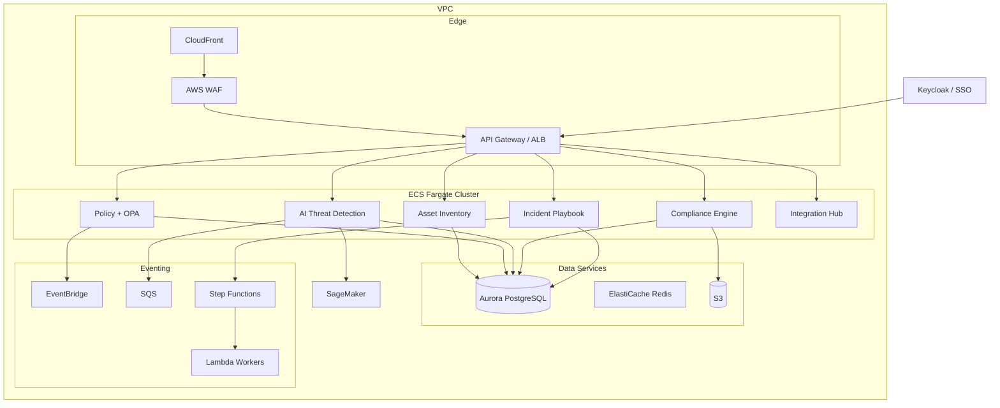

# Nền Tảng Bảo Mật SME trong Kỷ Nguyên AI
**Thiết Kế & Kiến Trúc Hệ Thống – Tổng Hợp**

> **Ngày:** 26/05/2026 | **Phạm vi:** SME 10–500 nhân sự | **Mô hình:** Hybrid (Build + Buy)

---

## Mục Lục

1. [Bối Cảnh & Bài Toán](#1-bối-cảnh--bài-toán)
2. [North Star Metric](#2-north-star-metric)
3. [Trải Nghiệm Người Dùng Thực Tế](#3-trải-nghiệm-người-dùng-thực-tế)
4. [Chiến Lược Build vs Buy](#4-chiến-lược-build-vs-buy)
5. [Kiến Trúc Hệ Thống](#5-kiến-trúc-hệ-thống)
6. [6 Phương Pháp Kiến Trúc Cốt Lõi](#6-6-phương-pháp-kiến-trúc-cốt-lõi)
   - 6.1 [Quản Trị AI & Phát Hiện Mối Đe Dọa](#61-quản-trị-ai--phát-hiện-mối-đe-dọa)
   - 6.2 [Xử Lý Sự Cố Tự Động (Playbooks)](#62-xử-lý-sự-cố-tự-động-playbooks)
   - 6.3 [Tích Hợp API-First](#63-tích-hợp-api-first)
   - 6.4 [Lightweight Endpoint Agent & Browser Extension](#64-lightweight-endpoint-agent--browser-extension)
   - 6.5 [Quản Trị Đa Khách Hàng (Multi-Tenancy)](#65-quản-trị-đa-khách-hàng-multi-tenancy)
   - 6.6 [Kiến Trúc Hướng Sự Kiện & Phục Hồi Lỗi](#66-kiến-trúc-hướng-sự-kiện--phục-hồi-lỗi)
7. [Kế Hoạch Đội Nhóm & Triển Khai (6 Tháng)](#7-kế-hoạch-đội-nhóm--triển-khai-6-tháng)
8. [Lộ Trình Phát Triển Tiếp Theo](#8-lộ-trình-phát-triển-tiếp-theo)

---

## 1. Bối Cảnh & Bài Toán

### Tại Sao SME Cần Nền Tảng Này?

Các doanh nghiệp vừa và nhỏ (SMEs) đang đối mặt với **làn sóng rủi ro mới từ AI**:

| Rủi ro | Ví dụ thực tế |
|--------|--------------|
| **Shadow AI** | Nhân viên dùng ChatGPT cá nhân xử lý dữ liệu khách hàng |
| **Data Leakage qua LLM** | Dán hợp đồng, mã nguồn, báo cáo tài chính vào AI công cộng |
| **Automated Spear-Phishing** | Email giả mạo cực kỳ tinh vi nhắm vào từng cá nhân |
| **Deepfake Fraud** | Video/audio giả CEO yêu cầu chuyển tiền khẩn |
| **Account Compromise** | Session hijacking vượt qua MFA |

### Thách Thức Đặc Thù của SME

- ❌ Không có đội SOC chuyên trách
- ❌ Ngân sách bảo mật hạn hẹp
- ❌ Nhân viên không có kiến thức bảo mật
- ❌ Không có quy trình xử lý sự cố chuẩn

### Giải Pháp: Nền Tảng Bảo Vệ Thống Nhất

> **Mục tiêu:** Hệ thống hoạt động như **"detector khói"** – im lặng khi mọi thứ ổn, lên tiếng khi có nguy hiểm, và hướng dẫn từng bước xử lý.

---

## 2. North Star Metric

> **Chỉ Số Chính:** Số lượng mối đe dọa AI nghiêm trọng được phát hiện và ngăn chặn **mà không làm gián đoạn năng suất nhân viên**

### Tiêu Chí Thành Công

| Chỉ số | Mục tiêu |
|--------|---------|
| **Detection Precision** | ≥ 85% (phát hiện đúng mối đe dọa thật) |
| **False Positive Rate** | < 15% (giảm cảnh báo sai) |
| **Alert Response Time** | < 5 phút (từ phát hiện đến thông báo) |
| **Incident Resolution** | ≤ 10 phút (nhân viên không chuyên giải quyết được) |

---

## 3. Trải Nghiệm Người Dùng Thực Tế

### 3.1 Nhân Viên Thường (95% người dùng)

**Tương tác hàng ngày: TỐI THIỂU – chủ yếu chạy nền**

```
Tự động (không cần nhân viên làm gì):
✓ Giám sát sử dụng AI tool (ChatGPT, Copilot...)
✓ Quét prompt tìm dữ liệu nhạy cảm (PII, credential, source code)
✓ Phát hiện Shadow AI (công cụ AI chưa được phê duyệt)

Chỉ tương tác khi cần:
→ Nhận cảnh báo vi phạm chính sách (hiếm)
→ Giải trình lý do dùng AI tool mới (thỉnh thoảng)
→ Theo playbook xử lý sự cố (rất hiếm)
```

### 3.2 IT Manager / Admin (1–2 người)

**Tương tác hàng ngày: 10–15 phút**

| Thời gian | Công việc |
|-----------|-----------|
| Sáng (5 phút) | Kiểm tra cảnh báo qua đêm |
| Sáng (3 phút) | Xem xét yêu cầu giải trình |
| Sáng (2 phút) | Phê duyệt/từ chối yêu cầu dùng AI tool |
| Hàng tuần | Review compliance, điều chỉnh chính sách |
| Hàng tháng | Xuất báo cáo audit, review xu hướng AI |

### 3.3 CEO / Ban Lãnh Đạo

**Tương tác hàng ngày: KHÔNG**

- Nền tảng bảo vệ tự động hoàn toàn
- Chỉ nhận alert khẩn qua email/Slack khi có sự cố nghiêm trọng
- Hàng quý: xem dashboard compliance (5 phút)
- Hàng năm: review báo cáo audit cho ISO/GDPR/SOC2 (30 phút)

### 3.4 Kịch Bản Ngày Thường vs Ngày Có Sự Cố

**Ngày bình thường:**
```
08:00 – Nền tảng quét 500 tương tác AI qua đêm → 0 cảnh báo
09:00 – IT Manager: "All clear, 3 yêu cầu đang chờ"
09:02 – Phê duyệt 2, từ chối 1 → xong
Cả ngày – Hệ thống chạy im lặng, nhân viên làm việc bình thường
```

**Ngày có sự cố:**
```
14:00 – Marketing Manager dán danh sách khách hàng vào ChatGPT
14:00 – Hệ thống phát hiện PII → chặn hành động + gửi alert
14:01 – Marketing Manager thấy alert → thực hiện 3 bước remediation
14:05 – Sự cố được giải quyết, ghi log để audit
14:06 – IT Manager nhận notification tóm tắt
Tổng thời gian gián đoạn: 5 phút
```

---

## 4. Chiến Lược Build vs Buy

> **Nguyên tắc:** Tự xây dựng những gì tạo ra lợi thế cạnh tranh. Mua/tích hợp những thứ là commodity.

| Thành Phần | Chiến Lược | Lý Do |
|-----------|-----------|-------|
| AI Threat Detection Engine | **Build** | Lợi thế cạnh tranh cốt lõi |
| Asset Inventory & Classification | **Build** | Logic đặc thù cho SME |
| Policy Orchestration (OPA) | **Build** | Bộ não điều phối chính sách |
| Compliance Engine | **Build** | Tự động hóa kiểm soát tuân thủ |
| Incident Playbook Service | **Build** | Workflow tùy chỉnh cho SME |
| Identity & SSO (Auth) | **Buy** | Keycloak / IdP tiêu chuẩn ngành |
| Deepfake Detection | **Buy API** | Tận dụng vendor chuyên biệt |
| SaaS Connectors (Google, M365, Slack) | **Buy/Integrate** | OAuth 2.0 chuẩn |
| ML Inference (Semantic Analysis) | **Buy API** | AWS Bedrock / OpenAI API |
| Cloud Infrastructure | **Buy** | AWS Managed Services (ECS, RDS, S3...) |

---

## 5. Kiến Trúc Hệ Thống

### 5.1 Kiến Trúc Tổng Quan (4 Tầng)

```
┌─────────────────────────────────────────────────────────────────────┐
│                    CLIENT LAYER (Presentation)                       │
│                                                                       │
│  ┌──────────────────────┐         ┌──────────────────────┐          │
│  │   Web Dashboard      │         │  Mobile/Desktop App  │          │
│  │   React + Next.js    │         │   Flutter/Dart       │          │
│  │   • Alert Triage     │         │   • Push Alerts      │          │
│  │   • Policy Config    │         │   • Quick Actions    │          │
│  │   • Compliance View  │         │   • Incident Wizard  │          │
│  └──────────────────────┘         └──────────────────────┘          │
└─────────────────────────────────────────────────────────────────────┘
                              │ HTTPS/TLS
                              ▼
┌─────────────────────────────────────────────────────────────────────┐
│                   API GATEWAY LAYER (Edge)                           │
│  CloudFront + WAF → API Gateway / ALB                               │
│  • Rate Limiting  • Auth (Keycloak/SSO)  • Request Routing          │
└─────────────────────────────────────────────────────────────────────┘
                              │
                              ▼
┌─────────────────────────────────────────────────────────────────────┐
│                APPLICATION LAYER (Business Logic)                    │
│                                                                       │
│  ┌──────────────┐  ┌──────────────┐  ┌──────────────┐              │
│  │ AI Threat    │  │ Policy       │  │ Asset        │              │
│  │ Detection    │  │ Orchestration│  │ Inventory    │              │
│  │ Python/FastAPI│  │ Go + OPA    │  │ Go           │              │
│  └──────────────┘  └──────────────┘  └──────────────┘              │
│  ┌──────────────┐  ┌──────────────┐  ┌──────────────┐              │
│  │ Compliance   │  │ Incident     │  │ Integration  │              │
│  │ Engine       │  │ Playbook     │  │ Hub          │              │
│  │ Python       │  │ Go           │  │ Plugin System│              │
│  └──────────────┘  └──────────────┘  └──────────────┘              │
└─────────────────────────────────────────────────────────────────────┘
                              │
                              ▼
┌─────────────────────────────────────────────────────────────────────┐
│               INFRASTRUCTURE LAYER (Data & Events)                   │
│                                                                       │
│  DATA: Aurora PostgreSQL │ ElastiCache Redis │ S3                   │
│  EVENTS: EventBridge │ SQS │ Step Functions │ Lambda                │
│  ML: SageMaker Endpoint │ CloudWatch │ SNS                          │
└─────────────────────────────────────────────────────────────────────┘
```

### 5.2 Luồng Phát Hiện Mối Đe Dọa AI

```
Nhân viên dùng AI tool (ChatGPT, Copilot...)
         │
         ▼
[Browser Extension / Desktop Agent]
         │ Capture prompt/data
         ▼
[API Gateway] ── Auth + Rate Limiting
         │
         ▼
[AI Threat Detection Service]
    1. Pattern Match (Regex – prompt injection, credentials)
    2. DLP Check (PII/financial/IP detection)
    3. ML Classifier (SageMaker – risk scoring)
    4. Risk Scoring (0–100 + severity level)
         │
    ┌────┴────────────────────────┐
    ▼                             ▼                    ▼
[Low Risk]              [Medium Risk]         [High/Critical]
• Chỉ log              • Advisory alert      • Chặn ngay
• Không action         • Yêu cầu giải trình  • Alert khẩn cấp
                               │                    │
                               ▼                    ▼
                        [EventBridge]         [SNS/Push]
                        [Step Functions]      Mobile/Email/Slack
```

### 5.3 Clean Architecture

```
┌─────────────────────────────────────────────────────┐
│              PRESENTATION LAYER                      │
│  Web UI (React)  │  Mobile (Flutter)  │  API Gateway │
├─────────────────────────────────────────────────────┤
│              APPLICATION LAYER                       │
│  ScanPromptUseCase │ EnforcePolicy │ DiscoverAssets  │
│  DetectShadowAI   │ ExecutePlaybook│ GenerateReport  │
├─────────────────────────────────────────────────────┤
│                DOMAIN LAYER                          │
│  Threat │ Policy │ Asset │ Incident │ ComplianceCtrl │
├─────────────────────────────────────────────────────┤
│            INFRASTRUCTURE LAYER                      │
│  PostgreSQL │ Redis │ S3 │ SageMaker │ SNS │ APIs    │
└─────────────────────────────────────────────────────┘
     ↑ Dependency Rule: Inner layers không phụ thuộc outer
```

### 5.4 Deployment (AWS-first)



---

## 6. 6 Phương Pháp Kiến Trúc Cốt Lõi

---

### 6.1 Quản Trị AI & Phát Hiện Mối Đe Dọa

> **Triết lý:** Không cấm nhân viên dùng AI (giảm năng suất), mà thiết lập **"Trạm Kiểm Soát"** giám sát mọi luồng dữ liệu đi vào/ra công cụ AI.

#### Kiến Trúc 2 Lớp Bảo Vệ

```
┌─────────────────────────────────────────────────────┐
│     LỚP 1: EDGE INSPECTION (Mili-giây)              │
│  ─────────────────────────────────────              │
│  Công nghệ: Regex + Hashing + WebAssembly (WASM)    │
│  Chạy tại: Trình duyệt / thiết bị client            │
│                                                       │
│  ✓ Phát hiện PII (thẻ tín dụng, email, CCCD)        │
│  ✓ Chặn từ khóa tĩnh (keyword blocklist)            │
│  ✓ Block ngay – không tốn băng thông server         │
└─────────────────────────────────────────────────────┘
                        │ (nếu vượt qua Lớp 1)
                        ▼
┌─────────────────────────────────────────────────────┐
│   LỚP 2: DEEP CONTEXTUAL INSPECTION (0.5–2 giây)   │
│  ─────────────────────────────────────────────      │
│  Công nghệ: Security LLM API + AWS Macie + NLP      │
│  Chạy tại: Backend server                            │
│                                                       │
│  ✓ Phát hiện mã nguồn / bí mật kinh doanh           │
│  ✓ Ngăn chặn Prompt Injection                       │
│  ✓ Dynamic Redaction (che lấp dữ liệu tự động)      │
└─────────────────────────────────────────────────────┘
```

#### Tính Năng "Dynamic Redaction" – Ăn Tiền Với SME

Thay vì chỉ **Chặn (Block)** cứng nhắc, hệ thống áp dụng **che lấp dữ liệu động**:

```
Nhân viên nhập:
  "Tóm tắt hợp đồng của khách hàng Nguyễn Văn A, SĐT 0901234567"
                        ↓ [Hệ thống can thiệp]
Gửi đến OpenAI:
  "Tóm tắt hợp đồng của khách hàng [PERSON_1], SĐT [PHONE_1]"
                        ↓ [LLM xử lý]
OpenAI trả về:
  "Hợp đồng dịch vụ của [PERSON_1], liên hệ [PHONE_1] để gia hạn"
                        ↓ [Hệ thống map ngược]
Nhân viên thấy:
  "Hợp đồng dịch vụ của Nguyễn Văn A, liên hệ 0901234567 để gia hạn"
```

> **Kết quả:** Nhân viên hoàn thành công việc, OpenAI **không biết** danh tính thật của khách hàng.

#### Quản Trị Hành Vi (Behavioral Governance)

| Tình huống | Phản ứng hệ thống |
|------------|-------------------|
| Vi phạm rõ ràng (PII, credentials) | Chặn ngay + alert |
| Vùng xám (code, văn bản mơ hồ) | Pop-up yêu cầu giải trình |
| Vi phạm lặp lại (5 lần / 10 phút) | Alert khẩn cho IT Manager |
| Mọi tương tác với AI | Ghi log audit đầy đủ |

---

### 6.2 Xử Lý Sự Cố Tự Động (Playbooks)

> **Triết lý:** SOAR truyền thống quá phức tạp với SME. Hệ thống này cung cấp **10–15 kịch bản mẫu sẵn có**, không cần cấu hình code.

#### Kiến Trúc Kỹ Thuật

```
[Event Sources]
  M365 Webhook │ Google Audit Log │ Browser Extension Telemetry
                        │
                        ▼
              [Message Broker: SQS]
                        │
                        ▼
              [Rules Engine: OPA/AI]
             Phân loại: Low / Medium / High / CRITICAL
                        │
           ─────────────┘ (nếu CRITICAL)
                        ▼
        [Workflow Engine: AWS Step Functions]
        • Lưu trữ trạng thái (Stateful)
        • Chịu lỗi: server crash → tiếp tục từ bước dừng
        • Human-in-the-loop: chờ phê duyệt nhiều giờ/ngày
```

#### Kịch Bản Thực Tế: Tài Khoản Bị Chiếm (2 giờ sáng)

```
Bước 1 – PHÁT HIỆN
M365 Webhook báo: Impossible Travel (Hà Nội → nước ngoài trong 1h)
                  + Mass download tài liệu tài chính
                        ↓
Bước 2 – ĐÁNH GIÁ
Rules Engine: CRITICAL → Kích hoạt Compromised_Account_Playbook
                        ↓
Bước 3 – CÔ LẬP (Tự động, vài giây)
✓ Microsoft 365 API: Revoke Sessions (đá hacker ra ngay)
✓ Microsoft 365 API: Suspend Account
                        ↓
Bước 4 – THÔNG BÁO (2 giờ sáng)
SMS + Voice Call đến Giám đốc:
"Tài khoản chị Lan Kế toán bị xâm nhập lúc 2h sáng.
 Đã khóa khẩn cấp. Vui lòng kiểm tra app quản trị."
                        ↓
Bước 5 – QUYẾT ĐỊNH (sáng hôm sau – 1-Click)
┌─────────────────────────────────────────────┐
│  [Xác nhận an toàn & Mở khóa]              │
│  (chị Lan đi công tác, Giám đốc xác nhận)  │
├─────────────────────────────────────────────┤
│  [Giữ khóa & Đổi mật khẩu]               │
│  (xác nhận bị hack → đổi pass bắt buộc)   │
└─────────────────────────────────────────────┘
```

#### Cơ Chế Chịu Lỗi (Resilience)

```
Bài toán: API Slack sập khi đang chạy playbook khóa tài khoản trên 4 nền tảng

Giải pháp:
┌─────────────────────────────────────────────────────┐
│  SAGA PATTERN                                        │
│  • Mỗi bước (khóa M365, khóa Google, khóa Slack)   │
│    là transaction độc lập                           │
│  • Slack thất bại → KHÔNG rollback M365/Google      │
│  • An toàn tối đa được ưu tiên                      │
├─────────────────────────────────────────────────────┤
│  CIRCUIT BREAKER + EXPONENTIAL BACKOFF              │
│  • API lỗi 503 → thử lại sau 10s, 30s, 2p, 5p...  │
│  • Tránh spam API (không bị ban/rate-limit)         │
├─────────────────────────────────────────────────────┤
│  DEAD LETTER QUEUE (DLQ)                            │
│  • Sau 5 lần thất bại → đẩy vào DLQ                │
│  • Alert trên Dashboard: "Slack chưa khóa được,    │
│    nhưng M365/Google đã an toàn. Kiểm tra thủ công"│
└─────────────────────────────────────────────────────┘
```

---

### 6.3 Tích Hợp API-First

> **Triết lý:** Hoạt động hoàn toàn ở tầng đám mây (Cloud-to-Cloud), không đụng phần cứng khách hàng.

#### 3 Lớp Kiến Trúc

```
┌─────────────────────────────────────────────────────┐
│  LỚP 1: QUẢN LÝ ĐỊNH DANH & ỦY QUYỀN              │
│  OAuth 2.0 + Enterprise App                         │
│  • Không cần mật khẩu Admin                        │
│  • Token lưu trữ trong AWS Secrets Manager / Vault │
│  • Token Rotation tự động                          │
└─────────────────────────────────────────────────────┘
                        │
                        ▼
┌─────────────────────────────────────────────────────┐
│  LỚP 2: THU THẬP SỰ KIỆN                          │
│  • Webhook (real-time): Google/Slack push event    │
│  • Polling (5–15 phút): backup, đảm bảo không bỏ  │
└─────────────────────────────────────────────────────┘
                        │
                        ▼
┌─────────────────────────────────────────────────────┐
│  LỚP 3: CHUẨN HÓA DỮ LIỆU                        │
│  Adapter Pattern: chuyển log Google/M365/Slack     │
│  → Unified Event Schema cho xử lý trung tâm       │
└─────────────────────────────────────────────────────┘
```

#### Kịch Bản Thực Tế: Offboarding Khẩn Cấp

```
Tình huống: Nhân viên Sales cấp cao nộp đơn nghỉ đột xuất,
            nguy cơ tẩu tán dữ liệu khách hàng + công thức sản phẩm
                        ↓
HR/IT nhấn nút [Offboard] trên Dashboard
                        ↓
Hệ thống xử lý SONG SONG (< 5 giây):

Google Workspace:                Slack:
✓ Đổi mật khẩu ngẫu nhiên      ✓ Vô hiệu hóa tài khoản
✓ Thu hồi OAuth tokens          ✓ Xóa khỏi tất cả channel
✓ Force logout tất cả trình     ✓ Chặn đọc lịch sử chat
  duyệt
✓ Hủy tất cả link share        QuickBooks:
  Google Drive                  ✓ Khóa quyền xem số dư
                                ✓ Khóa quyền truy cập hóa đơn
                        ↓
Audit Report tự động: chứng minh cô lập hoàn toàn
(hỗ trợ SOC 2 / ISO 27001)
```

#### Giải Pháp Kỹ Thuật Cho Các Thách Thức

| Thách thức | Giải pháp |
|-----------|-----------|
| **Rate Limiting** (API bị giới hạn request) | Token Bucket / Leaky Bucket algorithm tại API Client |
| **Webhook giả mạo** (attacker inject sự kiện) | HMAC-SHA256 Signature Verification (X-Slack-Signature) |
| **API đối tác thay đổi cấu trúc** | Integration Tests chạy hàng ngày (Daily Cron Jobs) trong CI/CD |

---

### 6.4 Lightweight Endpoint Agent & Browser Extension

> **Triết lý:** Bảo mật tối đa, ma sát tối thiểu. "Cài đặt xong là quên" – không làm chậm máy tính.

#### Thành Phần 1: Browser Extension

```
Công nghệ: Manifest V3 (Chrome/Edge chuẩn mới nhất)

Cơ chế hoạt động:
  Content Scripts ──► Hook DOM events (onCopy, onPaste, onDrop)
                              │
                              ▼
              [Local Processing – WebAssembly]
              Chạy trực tiếp trên RAM trình duyệt
              Quét Regex trong vài mili-giây
              (KHÔNG gửi text lên Cloud để kiểm tra)
                              │
              ┌───────────────┴──────────────────┐
              │ Vi phạm → Chặn request │ OK → pass │
              └──────────────────────────────────┘

Phạm vi giám sát (Privacy-by-Design):
  CHỈ kích hoạt trên: chatgpt.com, claude.ai, các trang share file rủi ro
  KHÔNG giám sát: Facebook, ngân hàng, trang web cá nhân
```

#### Thành Phần 2: Lightweight OS Agent

```
Công nghệ: Go / Rust → single binary < 20MB, RAM < 50MB
           Cross-platform: Windows + macOS + Linux

API Hệ Điều Hành (User-mode, KHÔNG can thiệp Kernel):
  Windows: Event Tracing for Windows (ETW)
  macOS:   Apple Endpoint Security Framework
```

#### Kịch Bản Thực Tế: Nhân Viên Muốn Tẩu Tán IP

```
Nhân viên: Cắm USB + mở trang web nén file tải lên bản vẽ thiết kế
                        │
           ┌────────────┴───────────────┐
           ▼                            ▼
[Browser Extension]              [OS Agent]
WASM đọc file header             ETW phát hiện FILE_WRITE
→ Nhận diện .dwg/.psd            → Nhắm đến Removable Storage
→ Drop HTTP POST request         → Đối chiếu Policy: "Cấm copy IP ra USB"
→ "Upload Failed"                → Trả ACCESS_DENIED cho OS
                                 → Khung copy Windows dừng lại
           └────────────┬───────────────┘
                        ▼
              [Alert + Telemetry]
              Pop-up: "Hành động sao chép tài sản trí tuệ
                       ra thiết bị ngoại vi đã bị ngăn chặn"
              gRPC/WebSocket → Backend → Ghi audit log
```

#### Lợi Ích Chi Phí (Cost Model)

```
90% xử lý tại máy client (Edge Computing)
→ Backend chỉ nhận log + phân phối Policy
→ Chi phí máy chủ Cloud giảm đáng kể
→ Hỗ trợ mô hình giá "Pay-as-you-grow" rất rẻ cho SME
```

---

### 6.5 Quản Trị Đa Khách Hàng (Multi-Tenancy)

> **Bài toán:** Bán giá rẻ (10$/user/tháng) → phải chia sẻ hạ tầng → nhưng dữ liệu bảo mật là tối mật.

#### Kiến Trúc Cách Ly Phân Cấp (Tiered Isolation)

```
┌──────────────────────────────────────────────────────────┐
│  GÓI CƠ BẢN: LOGICAL ISOLATION                          │
│                                                           │
│  Shared Database + Row-Level Security (RLS)              │
│                                                           │
│  Luồng hoạt động:                                        │
│  1. Request vào → Auth trích xuất tenant_id từ JWT      │
│  2. Microservice SET LOCAL app.current_tenant = 'A'     │
│  3. PostgreSQL RLS tự động lọc: chỉ trả row của Tenant A│
│  4. Code lỗi "SELECT * FROM events" vẫn an toàn         │
│     (DB engine chặn trước khi trả về)                   │
│                                                           │
│  ✓ Tuyệt đối ngăn Cross-Tenant Leakage do human error  │
└──────────────────────────────────────────────────────────┘
                              │
                              ▼
┌──────────────────────────────────────────────────────────┐
│  GÓI CAO CẤP: PHYSICAL ISOLATION (SOC2 / GDPR nghiêm)  │
│                                                           │
│  • S3 Bucket riêng biệt cho mỗi Tenant                  │
│  • Schema riêng biệt trong RDS (schema_tenant_A)        │
│  • Routing Connection String tự động theo Tenant        │
└──────────────────────────────────────────────────────────┘
```

#### Mã Hóa & Quản Lý Khóa (Envelope Encryption)

```
Dữ liệu cực nhạy cảm (OAuth tokens, nội dung prompt AI):

[Dữ liệu] → [Mã hóa bằng Data Key] → [Lưu trên DB]
                    ↑
            [Data Key được mã hóa bằng Customer KMS Key]
                    ↑
            [Mỗi Tenant có KMS Key RIÊNG trên AWS KMS]

Khi hủy hợp đồng / nghi bị hack:
→ Tenant thu hồi KMS Key của họ
→ Toàn bộ dữ liệu trên hệ thống trở thành "văn bản rác"
→ Crypto-shredding hoàn toàn (không cần xóa file)
→ Giải quyết nỗi lo Vendor Lock-in
```

#### Bài Kiểm Tra Thực Tế: Lỗi Code Junior Developer

```
Tình huống: Dev mới deploy bug, query quên lọc theo tenant
                        ↓
Admin Công ty Kế toán A gửi request
                        ↓
Middleware inject: SET LOCAL app.current_tenant = 'Tenant_A'
                        ↓
Dev viết: SELECT * FROM events (lỗi – thiếu WHERE)
                        ↓
PostgreSQL RLS can thiệp:
"Chỉ trả về rows của Tenant_A"
                        ↓
✓ Admin A nhận báo cáo đúng
✓ Dữ liệu Công ty B an toàn
✓ Bug vẫn tồn tại nhưng rủi ro bảo mật = 0
```

---

### 6.6 Kiến Trúc Hướng Sự Kiện & Phục Hồi Lỗi

> **Triết lý:** Bảo mật không thể phụ thuộc vào uptime 100% của API bên thứ 3. Hệ thống phải đảm bảo **eventual consistency** – các hành động bảo vệ sẽ được thực hiện, dù có chậm trễ.

#### Kiến Trúc Event-Driven

```
[Nguồn sự kiện]
  M365 Webhook │ Google Audit │ Endpoint Telemetry │ SaaS APIs
                              │
                              ▼
                    [EventBridge – Event Router]
                    • Định tuyến theo event type
                    • Schedule cho periodic scan
                              │
                   ┌──────────┴──────────┐
                   ▼                     ▼
               [SQS Queue]         [Step Functions]
               • Buffering         • Stateful playbooks
               • Backpressure      • Long-running workflows
               • DLQ support       • Human approval gates
                              │
                              ▼
                    [Lambda Workers]
                    • Xử lý bất đồng bộ
                    • Scale tự động
                    • Ghi kết quả vào S3/RDS
```

#### Tóm Tắt Các Pattern Chịu Lỗi

| Pattern | Mục đích | Khi nào dùng |
|---------|---------|-------------|
| **Saga** | Transaction phân tán an toàn | Playbook multi-step trên nhiều SaaS |
| **Circuit Breaker** | Ngắt khi API đối tác lỗi liên tục | Tránh cascade failure |
| **Exponential Backoff** | Retry thông minh | API trả 429/503 tạm thời |
| **Dead Letter Queue** | Không mất sự kiện | Sau N lần retry thất bại |
| **Idempotent Operations** | An toàn khi retry | Mọi action "revoke/suspend" |

---

## 7. Kế Hoạch Đội Nhóm & Triển Khai (6 Tháng)

### Đội Nhóm (8 FTE)

| Vai Trò | Số Lượng |
|---------|---------|
| Product / Security Analyst | 1 |
| Solution Architect / Tech Lead | 1 |
| Backend Engineer | 2 |
| Frontend Web Engineer | 1 |
| Flutter Engineer (Mobile/Desktop) | 2 |
| DevSecOps / QA | 1 |

### Lộ Trình 6 Tháng

```
Tháng 1: NỀN TẢNG
├── AWS foundation + VPC + security baseline
├── Tenant model + auth (Keycloak)
├── CI/CD pipeline
└── Integration skeletons (Google, M365, Slack)

Tháng 2: TÀI SẢN & CHÍNH SÁCH
├── Asset inventory + classification
├── Policy engine v1 (OPA)
└── Automated offboarding

Tháng 3: AI GOVERNANCE
├── Shadow AI detection (domain/API/OAuth discovery)
├── Prompt guard (Lớp 1: Regex/WASM)
├── DLP pattern controls (Lớp 2: Semantic)
└── Browser Extension + Desktop Agent v1

Tháng 4: SỰ CỐ & TUÂN THỦ
├── Incident playbooks (10–15 kịch bản mẫu)
├── Step Functions workflows
└── Compliance control mappings (ISO27001, GDPR, SOC2-lite)

Tháng 5: GIAO DIỆN & TRẢI NGHIỆM
├── Unified Web Dashboard (React/Next.js)
├── Flutter Mobile/Desktop app
└── Incident wizard UI + 1-click actions

Tháng 6: HOÀN THIỆN & RA MẮT
├── Security hardening + penetration testing
├── Pilot với 2–3 SME thực tế
├── False-positive tuning
└── Launch readiness checklist
```

### Rủi Ro Quan Trọng Nhất Cần Validate Sớm

> **Giả định rủi ro #1:** Chất lượng phát hiện AI đủ tốt để SME hành động, mà không bị ngập lụt false positive.
>
> **Cách validate:** Trong 6 tuần đầu, thu thập telemetry từ pilot và đo tỷ lệ false positive. Ngưỡng chấp nhận: < 15%.

---

## 8. Lộ Trình Phát Triển Tiếp Theo

### V2 – Scale Up (sau 6 tháng)

| Lĩnh Vực | Nâng Cấp |
|----------|---------|
| **Stream Processing** | EventBridge/SQS → Amazon MSK + Managed Flink |
| **Compute** | ECS Fargate → EKS (high-density services) |
| **Data** | + OpenSearch (hunt/search) + DynamoDB (high-throughput) + S3 Data Lake + Glue/Athena + Redshift |
| **AI/ML** | SageMaker Pipelines + Registry + KServe on EKS |
| **Multi-Tenancy** | Shard-by-segment + key-per-tenant + dedicated deployment |
| **Reliability** | OpenTelemetry + SLO/SLI + canary deployments + multi-region DR |

---

## Tóm Tắt Giá Trị Cốt Lõi

```
┌─────────────────────────────────────────────────────────────────────┐
│                      GIÁ TRỊ CỐT LÕI                               │
│                                                                       │
│  🎯 Phát hiện AI threats thực sự, ít false positive                │
│  ⚡ Phản ứng tự động trong giây, không cần nhân viên bảo mật       │
│  👤 Nhân viên không chuyên vẫn xử lý được sự cố                    │
│  💰 Giá rẻ, pay-as-you-grow, phù hợp ngân sách SME                │
│  📋 Compliance tự động (ISO 27001, GDPR, SOC2-lite)                │
│  🔒 Dữ liệu được cô lập tuyệt đối, kể cả khi code có bug          │
└─────────────────────────────────────────────────────────────────────┘
```

---

*Tài liệu tổng hợp từ: SME AI Security Platform Design (Hybrid Model) + Phân tích Kiến trúc Chi tiết*
*Cập nhật: 2026-05-26*
