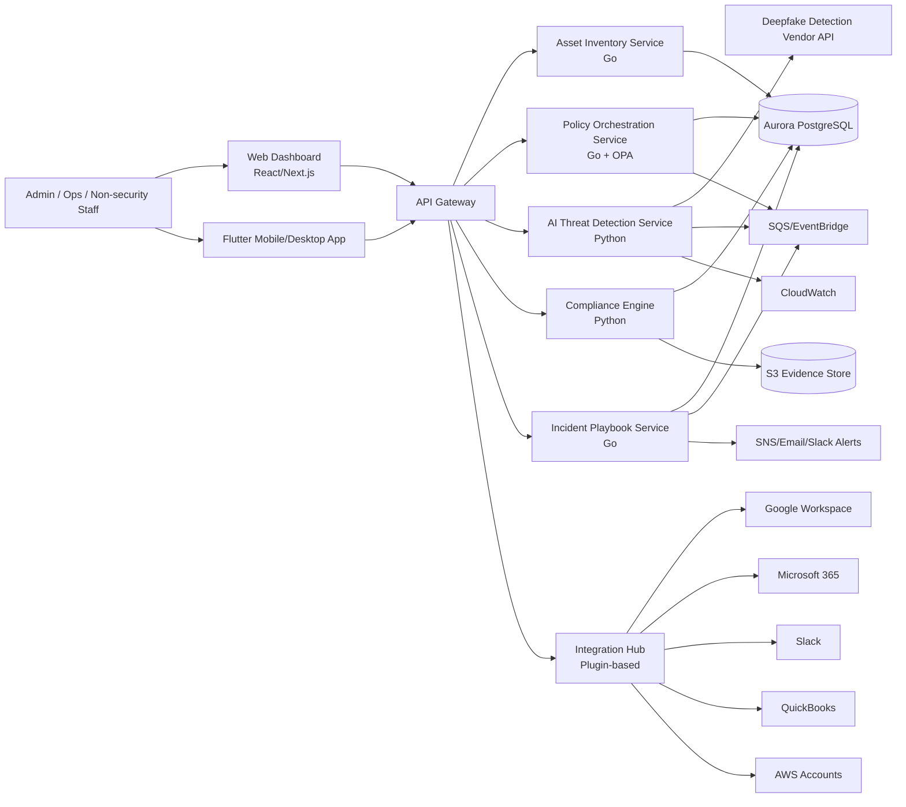
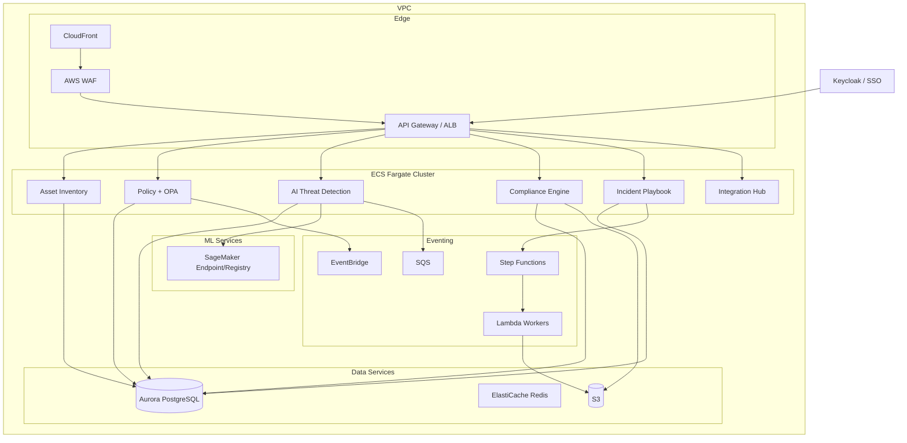

# SME AI Security Platform Design (Hybrid Model)

Date: 2026-05-26  
Scope: Strategic proposal for a unified SME protection platform (10–500 employees)

## North Star Metric

**Primary Metric:** Number of severe AI threats detected and prevented without disrupting employee productivity

**Success Criteria:**
- Detection precision ≥ 85% (correctly identify real threats)
- False positive rate < 15% (minimize incorrect alerts)
- Alert response time < 5 minutes (from detection to notification)
- Incident resolution by non-security staff ≤ 10 minutes (guided playbooks work)

**Why This Metric:**
SMEs lack dedicated security teams, so the platform must be both protective AND non-disruptive. This metric balances security effectiveness (catch threats) with user experience (don't annoy employees with false alarms). Success means the company is protected while employees can work normally.

## User Experience & Daily Usage

### For Regular Employees (95% of users)
**Daily interaction: MINIMAL - mostly background monitoring**

**What runs automatically (no employee action needed):**
- AI tool usage monitoring (ChatGPT, Copilot, etc.)
- Prompt scanning for sensitive data (PII, credentials, source code)
- Shadow AI discovery (detecting unapproved tools)

**When employees interact (only when needed):**
- **Alert notification** (mobile/desktop app): "You just pasted customer emails into ChatGPT - this violates data policy"
  - Action: Acknowledge + follow guided steps to remediate
  - Frequency: Rare (only when policy violation detected)
  
- **Justification request**: "You're using an unapproved AI tool - please explain business need"
  - Action: Type 1-2 sentences explaining why
  - Frequency: Occasional (when trying new AI tools)
  
- **Incident playbook** (rare): "Suspected account compromise - follow these 5 steps"
  - Action: Follow wizard-style guided steps
  - Frequency: Very rare (only during security incidents)

**Key point:** Employees don't "use" this app daily like they use Slack or email. It's invisible until something needs attention.

### For IT Manager / Admin (1-2 people)
**Daily interaction: 10-15 minutes reviewing dashboard**

**Morning routine:**
- Check dashboard for overnight alerts (5 min)
- Review pending justification requests (3 min)
- Approve/deny AI tool requests (2 min)

**Weekly tasks:**
- Review compliance status (10 min)
- Adjust policies if needed (15 min)
- Check asset inventory for new devices/accounts (10 min)

**Monthly tasks:**
- Export compliance reports for audit (5 min)
- Review AI usage trends (15 min)
- Update approved AI tool catalog (10 min)

### For CEO / Management
**Daily interaction: ZERO - only review when needed**

**What happens automatically:**
- Platform protects company in background
- Critical alerts escalated via email/Slack (rare)
- Compliance status tracked continuously

**When CEO interacts:**
- **Quarterly:** Review compliance dashboard (5 min) before board meeting
- **Annually:** Review audit reports for ISO/GDPR/SOC2 (30 min)
- **Incident:** Approve emergency actions if major breach detected (rare)

**Key value for CEO:**
- "Set it and forget it" protection
- No need to hire expensive security team
- Compliance achieved without manual work
- Peace of mind that AI risks are managed

### Real-World Scenario Example

**Normal day (no incidents):**
- 8:00 AM: Platform scans 500 employee AI interactions overnight → 0 alerts
- 9:00 AM: IT Manager checks dashboard → "All clear, 3 pending tool requests"
- 10:00 AM: IT Manager approves 2 requests, denies 1 → takes 2 minutes
- Rest of day: Platform monitors silently, employees work normally

**Day with incident:**
- 2:00 PM: Marketing Manager pastes customer list into ChatGPT
- 2:00 PM: Platform detects PII → blocks action + sends mobile alert
- 2:01 PM: Marketing Manager sees alert → follows 3-step remediation playbook
- 2:05 PM: Incident resolved, logged for compliance
- 2:06 PM: IT Manager gets summary notification
- Total disruption: 5 minutes for Marketing Manager, 1 minute for IT

**Key insight:** The platform is like a smoke detector - silent when everything is fine, loud when there's danger, and guides you through what to do.

## 1) System Architecture Diagram

### 1.1 Logical View

### 1.2 Deployment View (AWS-first)

## 2) Design Document (<=600 words)

This platform uses a hybrid architecture: build core differentiators and integrate commodity capabilities. The goal is to protect SME assets against AI-era threats without requiring a full-time security team.

Build vs buy is the primary decision. The system builds five core modules in-house: AI Threat Detection, Asset Inventory, Policy Orchestration, Compliance Engine, and Incident Playbook Service. Commodity functions are integrated instead of rebuilt: identity and SSO (Keycloak/IdP), SaaS connectors (Google Workspace, Microsoft 365, Slack, QuickBooks), and managed deepfake APIs. This reduces delivery risk in 6 months while preserving unique IP where it matters.

The multi-tenancy model is tenant-aware by default, with logical isolation in shared infrastructure using tenant-scoped access controls and row-level data isolation in Aurora PostgreSQL. For customers requiring stronger separation, the same services can be deployed in dedicated environments (private cloud/on-prem pattern). This supports a tiered commercial model without maintaining separate codebases.

AI threat detection strategy is phased. V1 prioritizes practical controls: prompt injection detection (rule + lightweight classifier), LLM data leakage controls (DLP patterns at browser/desktop endpoint), shadow AI discovery (domain/API/OAuth app detection), and deepfake fraud mitigation via vendor APIs plus out-of-band callback verification workflow. This approach targets high-risk scenarios while controlling false positives and implementation complexity. Model-heavy custom detection is deferred to later versions after telemetry and pilot feedback.

Data privacy guarantees are designed for SME trust and compliance: metadata-first collection, minimum necessary content retention, encryption in transit (TLS) and at rest (KMS-managed keys), tenant-scoped access boundaries, configurable retention, and audit trails for all high-risk actions. GDPR-aligned controls are included for export/delete workflows and evidence traceability.

Operationally, the platform is AWS-first and event-driven. ECS Fargate runs core services; EventBridge/SQS/Step Functions orchestrate asynchronous actions; S3 stores compliance evidence; CloudWatch/SNS provide monitoring and alerting. This keeps ops overhead manageable for a lean team while allowing future scale-out.

The architecture is explicitly designed for non-security operators. Incident response is playbook-driven with guided wizard steps, decision gates, and prebuilt communication templates. Automated offboarding and least-privilege enforcement reduce manual errors. Compliance posture is continuously measured against ISO 27001, GDPR, and SOC2-lite mappings with clear gap dashboards.

Economically, the platform fits SME constraints with tiered pricing and pay-as-you-grow adoption. Shared multi-tenant delivery keeps baseline costs low; premium tiers unlock stronger isolation, retention, and advanced integrations. This aligns product capability, security maturity, and budget progression over time.

## 3) Team & Delivery Plan (6 months)

Team (8 FTE): Product/Security Analyst (1), Solution Architect/Tech Lead (1), Backend (2), Frontend Web (1), Flutter (2), DevSecOps/QA (1).

- Month 1: AWS foundation, tenant model, auth baseline, integration skeletons.
- Month 2: Asset inventory + classification, policy engine v1, offboarding automation.
- Month 3: AI governance v1 (shadow AI, prompt guard, DLP pattern controls).
- Month 4: Incident playbooks + compliance control mappings.
- Month 5: Unified dashboard + Flutter mobile/desktop workflows.
- Month 6: Hardening, pilot with 2–3 SMEs, false-positive tuning, launch readiness.

Riskiest assumption to validate first: AI detection quality is actionable for SMEs without overwhelming false positives. Validate in first 6 weeks with pilot telemetry and acceptance thresholds.

## 4) AI Governance Module

Detection channels:
- Endpoint/browser telemetry for AI tool usage.
- Domain/API and OAuth app discovery for shadow AI.
- Prompt/data inspection via DLP patterns.

Governance controls:
- Approved AI tool catalog by department.
- Policy levels: advisory, justification-required, block.
- Sensitive data guardrails for PII/financial/IP/secrets.
- Automated offboarding: revoke tokens/sessions and third-party app access.

Operator UX:
- Risk scoring dashboard.
- Guided incident wizards for non-security staff.
- Full audit trail for compliance evidence.

## 5) Next Version (Large Scale) Tech Stack Notes

- Stream processing: migrate EventBridge/SQS-heavy paths to Amazon MSK + Managed Flink.
- Compute: expand from ECS/Lambda to EKS for high-density services.
- Data: add OpenSearch (hunt/search), DynamoDB (high-throughput state), S3 data lake + Glue/Athena, Redshift for advanced BI.
- AI/ML: SageMaker Pipelines + Registry, optional KServe on EKS for custom serving.
- Tenancy: shard-by-segment, key-per-tenant for high isolation tiers, dedicated tenant deployment options.
- Reliability: OpenTelemetry, SLO/SLI, canary deployments, multi-region DR.
